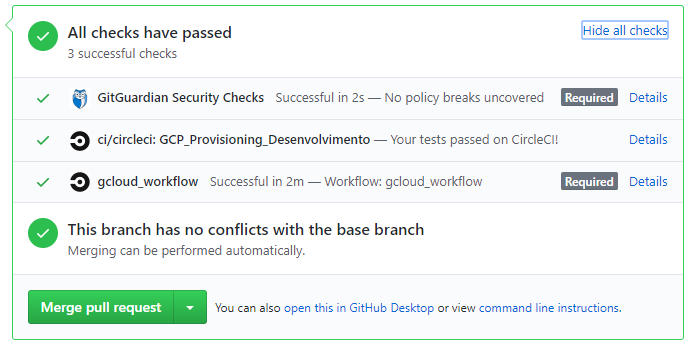

# Projeto Aplicado
Repositório para manter o código referente ao meu projeto aplicado

## Badge para avisos do status das builds no CircleCi

[](https://circleci.com/gh/dodopontocom/projeto-aplicado/tree/develop)

## Estrutura dos diretórios

```
.circleci
├── vars-ambientes
│    ├── prod.sh
│    ├── dev.sh
│    └── int.sh
└── config.yml
cloud
├── credentials
├── terraform
│    ├── apis.tf
│    ├── backend.tf
│    ├── gce-ubuntu.tf
│    ├── gcr.tf
│    ├── output.tf
│    ├── provider.tf
│    ├── terraform.tfvars
│    ├── variables.tf
│    └── vpc.tf
├── terraform-aws
│    ├── backend.tf
│    ├── ec2.tf
│    ├── vpc.tf
│    └── variables.tf
app
```

## Mensagens especiais nos commits

As seguintes "flags" podem ser adicionadas (entre colchetes [ ]) em qualquer lugar da mensagem do commit  
- `[skip ci]` - Faz com que o CircleCi não execute  
- `[gpc-plan]` - Executa o CircleCi apenas para verificação se o terraform está ok  
- `[gcp-apply]` - Constroi a infraestrutura da Nuvem (provisiona os recursos listados na pasta do terraform)  
- `[gcp-destroy]` - Desconstroi a infraestrutura da Nuvem (ótimo para desligar todos os recursos e economizar) 
- `[aws-plan]` - Executa o CircleCi apenas para verificação se o terraform está ok  
- `[aws-apply]` - Constroi a infraestrutura da Nuvem (provisiona os recursos listados na pasta do terraform)  
- `[aws-destroy]` - Desconstroi a infraestrutura da Nuvem (ótimo para desligar todos os recursos e economizar)  

- `[skip-docker]` - Faz com que execute o CircleCi mas pule a opção de atualizar a imagem docker da aplicação  
- `[wip]` - (Working in progress) Executa apenas o passo de construir a aplicação (aqui, subintende que os recursos na Nuvem já estejam criados)

`Nota¹:` Caso nenhuma das flags sejam usadas, a flag padrão `[wip]` é acionada  
`Nota²:` Até duas flags podem sem combinadas por commit: exemplo.: `[skip-docker][tf-apply] provisionar infra mas pular passo de atualizar a imagem docker`  

## Estrutura das Branches

Branches protegidas (não são permitidos commits diretos e necessitam algumas verificações)  
`master`  
`develop`

Verificações devem ser cumpridas para que merges possam ser aceitos  

